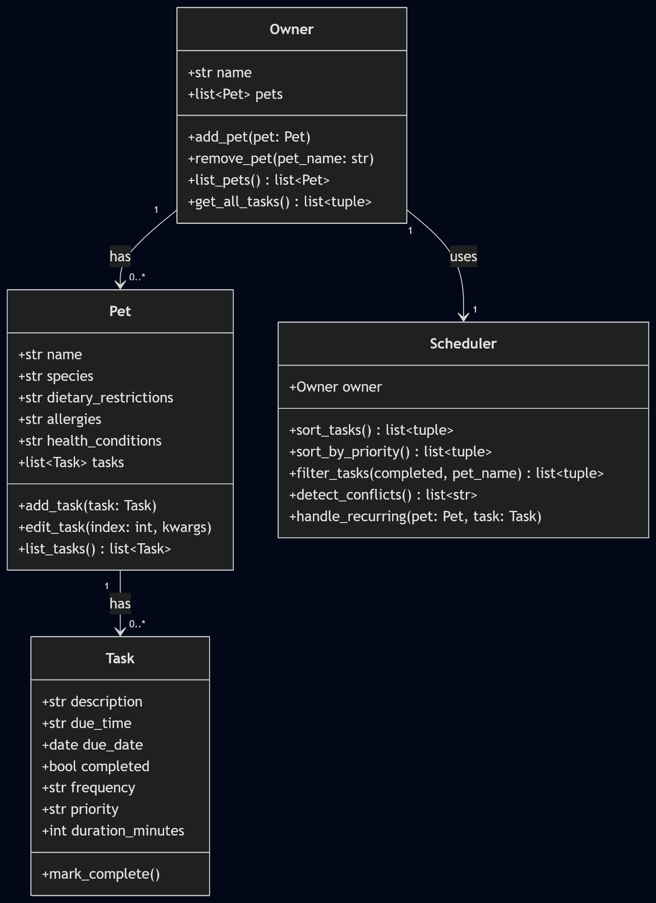
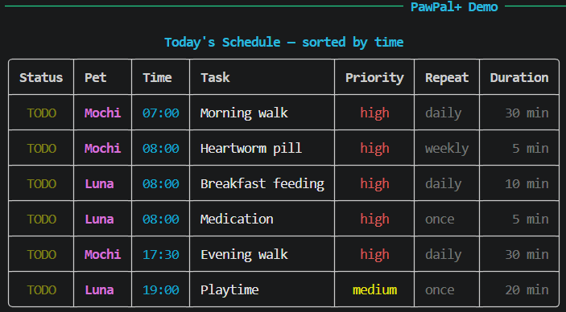
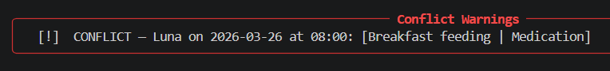
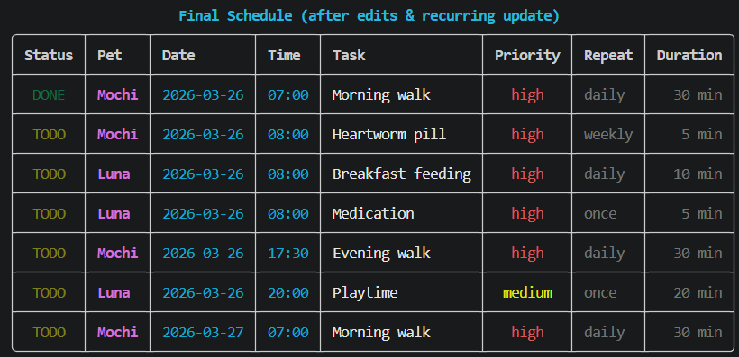

# PawPal+ (Module 2 Project)

**PawPal+** is a pet care scheduling assistant built with Python and Streamlit. It helps a busy pet owner stay consistent with daily routines by tracking tasks across multiple pets, generating a sorted daily schedule, detecting time conflicts, and automatically rescheduling recurring tasks.

---

## Features

| Feature | Description |
|---|---|
| **Sort by time** | All tasks across all pets are returned in chronological order (by due date, then due time) so the owner always sees what's coming up next. |
| **Sort by priority** | Tasks can be sorted high → medium → low, with time used as a tiebreaker. Selectable in the UI via a Sort popover. |
| **Filter tasks** | Narrow the task list by pet name, completion status, or both. A live counter shows how many tasks match the current filter. |
| **Conflict warnings** | If two tasks are scheduled for the same pet at the same date and time, a human-readable warning is shown — no crashing, just a yellow banner. Fires on task add and on Generate Schedule. |
| **Daily recurrence** | Marking a `daily` task complete automatically creates the next occurrence dated +1 day, with all fields (priority, duration, frequency) preserved. |
| **Weekly recurrence** | Same as daily recurrence but creates the next occurrence +7 days out. |
| **Task editing** | Any field on an existing task (description, time, date, priority, frequency, duration) can be updated in-place via an Edit expander. |
| **Find next available slot** | Scans a pet's schedule from a given date and returns the earliest open window of a requested duration, searching up to a configurable number of days ahead. Returns `(date, "HH:MM")` or `None` if no window is found. |
| **Data persistence** | Pets and tasks are saved to `data.json` automatically after every change (add pet, add task, complete, edit). On the next app launch, `Owner.load_from_json()` restores the full state so nothing is lost between runs. |

---

## System Architecture

PawPal+ is built around four Python classes in `pawpal_system.py`:

| Class | Responsibility |
|---|---|
| **Task** | A single care activity. Holds description, scheduled time, due date, completion status, recurrence frequency, priority, and duration. |
| **Pet** | An individual animal with health context (dietary restrictions, allergies, health conditions) and a personal task list. Supports adding, editing, and listing tasks. |
| **Owner** | The top-level entity. Manages a collection of pets and exposes `get_all_tasks()` which returns every `(Pet, Task)` pair across all pets — the data contract the rest of the system depends on. |
| **Scheduler** | The algorithmic layer. Takes an Owner and reads tasks fresh on every call. Responsible for sorting, filtering, conflict detection, and recurring task automation. |

### Class Relationships

```
Owner "1" --> "0..*" Pet : has
Pet   "1" --> "0..*" Task : has
Owner "1" --> "1"    Scheduler : uses
```

### UML Diagram



---

## 📸 Demo

### CLI Demo (`main.py`)

Today's Schedule — tasks sorted chronologically across all pets:



Conflict Warning — two tasks for the same pet at the same time:



Final Schedule — after recurring task completion and rescheduling:



### Streamlit UI (`app.py`)

*Screenshot coming after UI polish pass.*

---

## Running the Demo

The CLI demo in `main.py` creates one Owner (Jordan), two Pets (Mochi the dog and Luna the cat), and six tasks. It exercises all five Scheduler features and prints richly formatted output using the `rich` library (tables, panels, color-coded priority).

```bash
python main.py
```

Expected output includes: a schedule sorted by time, a schedule sorted by priority, a conflict warning for Luna's 08:00 overlap, a filtered pending task list, a Mochi-only filtered view, a recurring task being completed and rescheduled (with all fields preserved), a task edit, and a pet being added then removed.

To launch the Streamlit UI:

```bash
streamlit run app.py
```

---

## Testing PawPal+

```bash
python -m pytest
```

The test suite in `tests/test_pawpal.py` contains 15 tests organized into two groups:

**Core behavior (tests 1–6)** — verifies that the fundamental building blocks work correctly.

| Test | What it verifies |
|---|---|
| `test_task_mark_complete` | `mark_complete()` flips `completed` from False to True |
| `test_add_task_increases_count` | `add_task()` grows the pet's task list by exactly 1 |
| `test_sort_tasks_chronological` | `sort_tasks()` returns tasks in ascending time order across multiple pets |
| `test_filter_tasks_by_completed_status` | `filter_tasks(completed=True)` returns only finished tasks |
| `test_detect_conflicts_same_pet_same_time` | `detect_conflicts()` flags same-pet same-time collisions |
| `test_handle_recurring_daily` | Completing a daily task creates a new task dated tomorrow |

**Edge cases (tests 7–12)** — verifies boundary conditions and less-obvious behaviors.

| Test | What it verifies |
|---|---|
| `test_sort_by_priority_order` | `sort_by_priority()` returns tasks in high → medium → low order |
| `test_filter_tasks_by_pet_name` | `filter_tasks(pet_name=...)` returns only tasks belonging to the named pet |
| `test_handle_recurring_weekly` | Completing a weekly task creates a new task 7 days out, with all fields preserved |
| `test_handle_recurring_once_no_new_task` | Completing a one-time task marks it done without generating a follow-up |
| `test_owner_no_pets_empty_results` | `sort_tasks()`, `detect_conflicts()`, and `filter_tasks()` all return `[]` safely when the owner has no pets |
| `test_edit_task_validation` | `edit_task()` applies valid field updates and raises `ValueError` for unknown field names |
| `test_find_next_available_slot_basic` | Returns the correct start time for the first gap that fits the requested duration |
| `test_find_next_available_slot_rolls_to_next_day` | Advances to the next calendar day when no gap exists today |
| `test_find_next_available_slot_returns_none_when_exhausted` | Returns `None` after exhausting `max_days_ahead` with no valid slot found |

**Confidence level: ★★★★★** — all required behaviors and known edge cases are covered across all four classes and all five Scheduler features.

---

## How Claude Code Agent Mode Was Used

The `find_next_available_slot` algorithm was designed and implemented with Claude Code running in **Agent Mode** — an agentic workflow where the AI reads, plans, and writes code across multiple files in a single session rather than handling one prompt at a time.

**What Agent Mode did in this session:**

- Read all five target files (`pawpal_system.py`, `main.py`, `app.py`, `tests/test_pawpal.py`, `README.md`) before writing a single line, building a full picture of existing conventions.
- Determined that the `datetime` class was *not* needed (time arithmetic is done in integer minutes), avoiding a spurious import that Pylance would have flagged.
- Designed a gap-scan algorithm (O(n log n) sort + O(n) linear scan) instead of a brute-force minute-by-minute loop, keeping the method fast and readable.
- Matched the Streamlit UI layout to existing patterns — advanced options hidden in `st.expander`, consistent with the Sort/Filter `st.popover` controls already in the file.
- Wrote the three new tests (13–15) following the exact `# ── Test N: description ──` comment convention and numbering already in the test file.

**What was reviewed before accepting:**

- The `duration_minutes = 0` edge case: a zero-duration task produces an empty interval `(start, start)` that the linear scan skips — verified correct without adding a special guard.
- The `day_start >= day_end` guard: added because the UI exposes both as free `time_input` widgets that a user could invert.
- `ValueError` for unknown pet names: kept consistent with `handle_recurring`'s own error-raising behavior rather than returning `None` silently.

Agent Mode is most valuable when a feature touches multiple files and requires understanding existing conventions before deciding *how* to implement. The ability to read, reason across files, and write in a single session — without the developer re-explaining context for each file — is the meaningful productivity gain over a standard chat prompt.

---

## Setup

```bash
python -m venv .venv
source .venv/bin/activate  # Windows: .venv\Scripts\activate
pip install -r requirements.txt
```

---

## Project Structure

```
pawpal_system.py      # Core logic: Task, Pet, Owner, Scheduler
main.py               # CLI demo script (rich-formatted output)
app.py                # Streamlit UI — sort, filter, complete, and edit tasks
data.json             # Auto-generated; persists pets and tasks between runs
tests/
  test_pawpal.py      # Pytest suite (17 tests)
Mermaid.js            # UML class diagram source (paste into mermaid.live)
img/
  uml_final.png       # Final UML class diagram
  mainpy_*.png        # CLI demo screenshots
reflection.md         # Design decisions and AI collaboration notes
```
